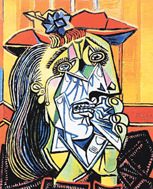

# Portfolio

중부대학교 게임소프트웨어학과 91913256_김재훈

## 환경설정

pip install -r requirements.txt

## Style transfer 결과

<table align="center">
  <tr>
    <th style="text-align: center;">Content Image</th>
    <th style="text-align: center;">Style Image</th>
  </tr>
  <tr>
    <td></td>
    <td></td>
  </tr>
</table>

<table align="center">
  <tr>
    <th style="text-align: center;">Optimizer: Adam</th>
    <th style="text-align: center;">Optimizer: LBFGS (paper)</th>
  </tr>
  <tr>
    <td></td>
    <td></td>
  </tr>
</table>
