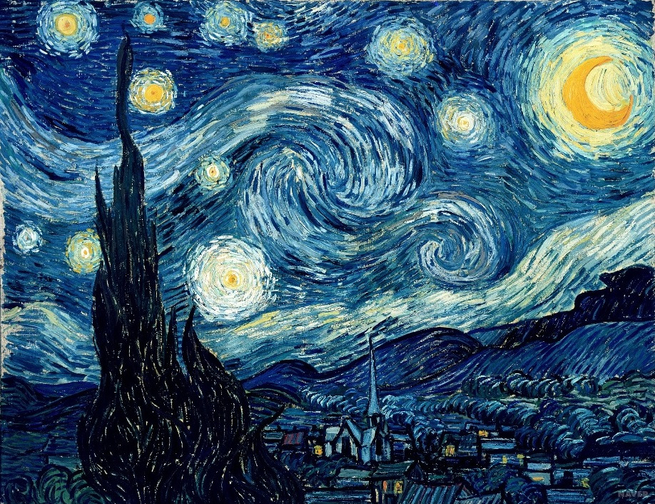

# Portfolio

중부대학교 게임소프트웨어학과 91913256_김재훈

## Manual

1. 변환될 이미지 (content.jpg) + 스타일 이미지 (style.jpg) 준비
2. 이미지를 Colab Notebooks/data 에 넣기
3. 처음 실행인 경우 처음부터 실행, 이후부터는 cfg 부터 실행
4. 10epoch 마다 Colab Notebooks/output에 저장

## Style transfer 결과

<table align="center">
  <tr>
    <th style="text-align: center;">Content Image</th>
    <th style="text-align: center;">Style Image</th>
  </tr>
  <tr>
    <td></td>
    <td></td>
  </tr>
</table>

<table align="center">
  <tr>
    <th style="text-align: center;">Epoch: 20</th>
    <th style="text-align: center;">Epoch: 100</th>
  </tr>
  <tr>
    <td></td>
    <td></td>
  </tr>
</table>
